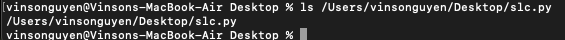
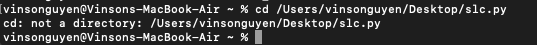

The absolute path to the working directory before the command was run was /Users/vinsonguyen/Desktop
The output listed out all the files and contents within the current directory, which was Desktop. There was no error.

The absolute path to the working directory before the command was run was /Uers/vinsonguyen/Desktop
The output listed out all the files and contents within the directory that the path pointed to, which was dsc30_wi24. There was no error.

The absolute path to the working directory before the command was run was /Users/vinsonguyen/Desktop
The output just displayed the name of the file, if the file exists. Again, there is no error.

The absolute path to the working directory before the command was run was just the home directory, /Users/vinsonguyen
'cd' with no arguments would just go back to the home directory, but since the current working directory was already the home directory, no change. There is no errors.

The absolute path to the working directory before the command was run was /Users/vinsonguyen/Desktop
After doing the command, the current working directory was updated to dsc30_wi24 because this is the directory indicated by the path. There is no error.

The absolute path to the working directory before the command was run was /Users/vinsonguyen
After doing this command, an error pops up. This is because we can not 'cd' to a file, we can only 'cd' to directories, which slc.py is not. 

The absolute path to the working directory before the command was run was /Users/vinsonguyen
Running 'cat' without any arguments, no output is produced. Instead, the computer is awaiting arguments to inputted.

The absolute path to the working directory before the command was run was /Users/vinsonguyen
Running 'cat' with a path to Desktop produces an error. Directories can not be read like how files are, so when using 'cat' on a path Desktop, nothing meaningful is outputted.

The absolute path to the working directory before the command was run was /Users/vinsonguyen/Desktop
Running 'cat' with a path to a file, in this case mode.py, will display the contents within the file, as shown. 

